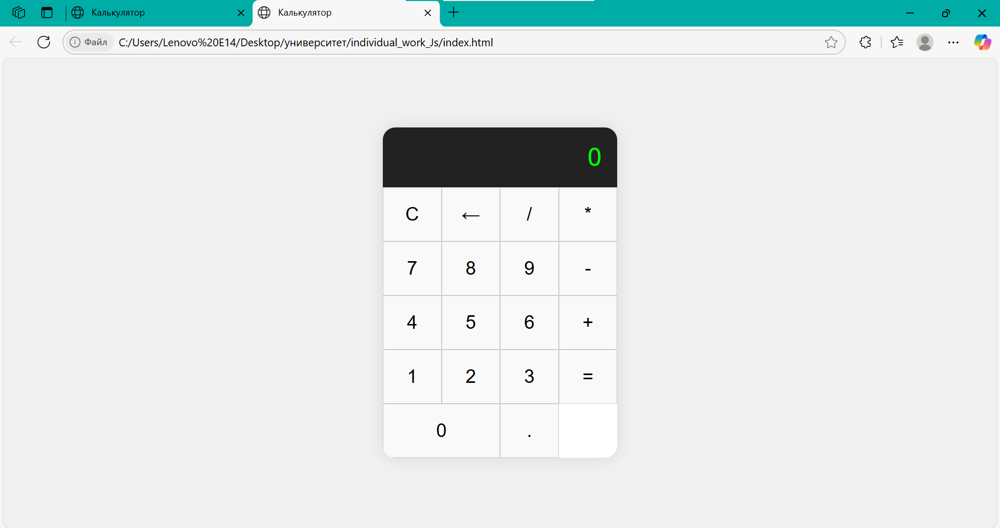

### Индивидуальная работа

## Выполнил: Шакура Владислав IA-2404

## Описание
Простой калькулятор, написанный на чистом JavaScript , демонстрирует работу с DOM, событиями, валидацией и модульной архитектурой.
## Цель проекта
Развитие и подтверждение практических навыков программирования на JavaScript без использования сторонних библиотек или фреймворков.

Проект демонстрирует:
- Уверенное владение DOM API
- Обработку событий и пользовательского ввода
- Валидацию и управление данными
- Организацию кода по модульному принципу
- Создание адаптивного и интерактивного пользовательского интерфейса


## Возможности
- Поддержка базовых арифметических операций (`+`, `-`, `*`, `/`)
- Очистка и удаление последнего символа
- Валидация выражений
- Адаптивный и современный интерфейс

## Структура проекта
├── index.html // Основная страница
├── style.css // Стилизация интерфейса
├── js/
│ ├── main.js // Инициализация приложения
│ ├── ui.js // Работа с DOM и событиями
│ └── calculator.js // Логика вычислений
└── README.md // Отчет и инструкция
---

##  Описание функций

###  `js/main.js`
```js
import { setupUI } from './ui.js';

document.addEventListener('DOMContentLoaded', () => {
  setupUI();
});
```
- Загружает и инициализирует пользовательский интерфейс после полной загрузки DOM.

---

###  `js/ui.js`
```js
export function setupUI() {
  const display = document.getElementById('display');
  const buttons = document.querySelectorAll('.buttons button');

  buttons.forEach(button => {
    button.addEventListener('click', () => {
      handleInput(button, display);
    });
  });
}
```
- `setupUI()` — получает ссылки на элементы DOM и навешивает обработчики событий на кнопки калькулятора.
- При нажатии кнопки вызывает функцию `handleInput` из модуля `calculator.js`.

---

###  `js/calculator.js`
```js
let expression = '';

export function handleInput(button, display) {
  const digit = button.dataset.digit;
  const action = button.dataset.action;

  if (digit !== undefined) {
    expression += digit;
  } else if (action === 'clear') {
    expression = '';
  } else if (action === 'delete') {
    expression = expression.slice(0, -1);
  } else if (action === 'operator') {
    const operator = button.textContent;
    if (expression && !/[+\-*/]$/.test(expression)) {
      expression += operator;
    }
  } else if (action === 'equals') {
    try {
      if (/^[0-9.+\-*/]+$/.test(expression)) {
        expression = eval(expression).toString();
      } else {
        expression = 'Ошибка';
      }
    } catch {
      expression = 'Ошибка';
    }
  }

  display.textContent = expression || '0';
}
```

- `expression` — переменная, хранящая текущее введенное выражение.
- `handleInput(button, display)` — основная логика калькулятора:
  - Обрабатывает цифры и операторы.
  - Очищает поле или удаляет последний символ.
  - Вычисляет выражение с помощью `eval()`.
  - Проверяет корректность выражения перед вычислением.
  - Отображает результат или сообщение об ошибке.

---
## Скриншот интерфейса

## Заключение

Проект был реализован в рамках индивидуального задания для отработки навыков работы с JavaScript и DOM API.  
Все ключевые функции калькулятора были выполнены с соблюдением модульной структуры и современного синтаксиса.

