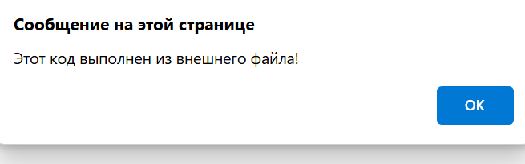

Цель работы:
Познакомиться с основами JavaScript, научиться писать и выполнять код в браузере и в локальной среде, разобраться с базовыми конструкциями языка.
Выполнение Лабораторной работы:

Задание 1:

1 Подготовка среды:
Установливаем текстовый редактор  VS Code.
Установливаем Node.js с официального сайта.
Далее открываем DevTools в браузере (нажмите F12 и выберите вкладку Консоль).
2 Выполняем код JavaScript в браузере
Открываем консоль разработчика (F12 → Console).
Пишем команду console.log("Hello, world!");
Команда выводит

Далее записываем в консоли 2 + 3.
В консоле выводится 5:

3 Создаем первую HTML-страницу с JavaScript
Создайте файл index.html и вставьте в него следующий код.

<!DOCTYPE html>
<html lang="en">
 <head>
   <title>Привет, мир!</title>
 </head>
 <body>
   
 </body>
</html>

Открывается окно:

4 Подключаем внешний JavaScript-файл
Создаем файл script.js и добавляем в него код:

alert("Этот код выполнен из внешнего файла!");
console.log("Сообщение в консоли");

Далее Подключаем файл в index.html, добавив в <head>

Открываем страницу в браузере.

Задание 2:

1 Объявляем переменные и работа с типами данных.
В файле script.js создаем несколько переменных:

   let birthYear = 20;
   const Name = "Владислав";
   var isStudent = 25;
   console.log(birthYear, Name, isStudent);

Вот что выводится в консоль:

Добавьте следующий код в script.js:

let score = prompt("Введите ваш балл:");
if (score >= 90) {
 console.log("Отлично!");
} else if (score >= 70) {
 console.log("Хорошо");
} else {
 console.log("Можно лучше!");
}

for (let i = 1; i <= 5; i++) {
 console.log(`Итерация: ${i}`);
}
Открываем страницу в браузере и смотрим, как работают условия и циклы.

Задание 3

Контрольные вопросы:

Чем отличается var от let и const?
var, в отличии от let, позволяет обратиться к себе из любой части программы и доступны вне своего блока (например объявлена в цикле для итерации, однако обратиться к ней можно и после его завершения), так же позволяет объявлять переменные с одинаковыми именами, что приводит к проблемам с поддерживанием кода. Const же создает константные переменные (их значения невозможно изменить после инициализации)

Что такое неявное преобразование типов в JavaScript? Неявное преобразование типов - автоматическое приведение одного типа данных к другому, зачастую в следствии присутствия переменных разных типов в одном выражении (например float 5.3 + int 2 = float 7.3)

Как работает оператор == в сравнении с ===? Оператор сравнения == сравнивает два значения, и при необходимости вызывает конвертацию одного типа данных в другой. Оператор === же выполняет ту же функцию, но не вызывает неявную конвертацию.

